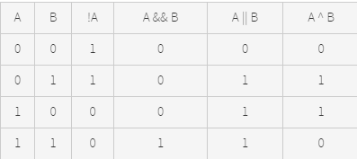

# Bit Manipulation



## Two's Complement and Negative Numbers

Computers typically store integers in two's complement representation. 

A positive number is represented as itself while a negative number is represented as the two's complement of its absolute value (with a 1 in it's sign bit to indicate that a negative value).

The two's complement of an N-bit number (where N is the number of bits used for the number, excluding the sign bit) is the complement of the number with respect to 2N.

Two's complement is calculated as One's complement and adding 1 to the result. One's complement is simply the inversion of bits.

---

## Arithmetic vs. Logical Right Shift

There are two types of right shift operators. The arithmetic right shift essentially divides by two. The logical
right shift does what we would visually see as shifting the bits.

In a logical right shift, we shift the bits and put a 0 in the most significant bit. It is indicated with a `>>>`
operator. On an 8-bit integer (where the sign bit is the most Significant bit), this would look like the image
below. The sign bit is indicated with a gray background.


In an arithmetic right shift, we shift values to the right but fill in the new bits with the value of the sign bit.
This has the effect of (roughly) dividing by two. It is indicated by a `>>` operator.


---

## Common Bit Tasks: Getting and Setting

### Masking

A mask defines which bits you want to keep, and which bits you want to clear.

Masking is the act of applying a mask to a value. This is accomplished by doing:

- Bitwise ANDing in order to extract a subset of the bits in the value
- Bitwise ORing in order to set a subset of the bits in the value
- Bitwise XORing in order to toggle a subset of the bits in the value

Below is an example of extracting a subset of the bits in the value:

```
Mask:   00001111b
Value:  01010101b
```

Applying the mask to the value means that we want to clear the first (higher) 4 bits, and keep the last (lower) 4 bits. Thus we have extracted the lower 4 bits. The result is:

```
Mask:   00001111b
Value:  01010101b
Result: 00000101b
```

### Get Bit

This method shifts lover by `i` bits, creating a value that looks like `00010000`. By performing an AND with
num, we clear all bits other than the bit at bit `i`. Finally, we compare that to `0`. If that new value is not zero,
then bit `i` must have a `1`. Otherwise, bit `i` is a `0`.

```java
boolean getBit(int num, int i) {
	return ((num & (1 << i)) != 0);
}
```

### Set Bit

SetBit shifts lover by `i` bits, creating a value like `00010000`. By performing an OR with num, only the
value at bit `i` will change. All other bits of the mask are zero and will not affect num.
```java
int setBit(int num, i nt i) {
	return num I (1 << i);
}
```

### Clear Bit
This method operates in almost the reverse of setBit . First, we create a number like `11101111` by creating
the reverse of `00010000` and negating it. Then, we perform an AND with num. This will clear the i<sup>th</sup> bit
and leave the remainder unchanged.

```java
int clearBit(int num, int i) {
	int mask = ~(1 << i);
	return num & mask;
}
```

### Update Bit

To set the i<sup>th</sup> bit to a value v, we first clear the bit at position `i` by using a mask that looks like 11101111.
Then, we shift the intended value, v, left by i bits. This will create a number with bit i equal to v and all
other bits equal to 0. Finally, we OR these two numbers, updating the ith bit if v is 1 and leaving it as 0
otherwise.

```java
 int updateBit(int num, int i, boolean bitIs1) {
 int value = bitIs1 ? 1 : 0;
 int mask = ~(1 << i);
 return (num & mask) | (value << i);
 }
``` 

---

## Count set bits in an integer

Brian Kernighan’s Algorithm:

```
   1  Initialize count: = 0
   2  If integer n is not zero
      (a) Do bitwise & with (n-1) and assign the value back to n
          n: = n&(n-1)
      (b) Increment count by 1
      (c) go to step 2
   3  Else return count
```   