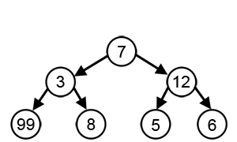

# Greedy Algorithms
---

A greedy algorithm, as the name suggests, **always makes the choice that looks best at that moment**.

An algorithm is designed to achieve optimum solution for a given problem. In greedy algorithm approach, decisions are made from the given solution domain. As being greedy, the closest solution that seems to provide an optimum solution is chosen.

Greedy algorithms try to find a localized optimum solution, which may eventually lead to globally optimized solutions. However, generally greedy algorithms do not provide globally optimized solutions.

 
Greedy algorithms should be applied to problems exhibiting these two properties:

- **Greedy choice property** - make whatever choice seems best at the moment and then solve the subproblems that arise later.

- **Optimal substructure** - A problem exhibits optimal substructure if an optimal solution to the problem contains optimal solutions to the sub-problems.

 
---

Greedy algorithms have five components:

- A candidate (set, list, etc), from which a solution is created

- A selection function, which chooses the best candidate to be added to the solution

- A feasibility function, that is used to determine if a candidate can be used to contribute to a solution

- An objective function, which assigns a value to a solution, or a partial solution, and

- A solution function, which will indicate when we have discovered a complete solution

Examples:
---

- Kruskal's Minimal Spanning Tree Algorithm

	In Kruskal’s algorithm, we create a MST by picking edges one by one. The Greedy Choice is to pick the smallest weight edge that doesn’t cause a cycle in the MST constructed so far.

- Prim's Minimal Spanning Tree Algorithm
	
	In Prim’s algorithm also, we create a MST by picking edges one by one. We maintain two sets: set of the vertices already included in MST and the set of the vertices not yet included. The Greedy Choice is to pick the smallest weight edge that connects the two sets.	

- Dijkstra's Minimal Spanning Tree Algorithm

- Huffman Coding

	Huffman Coding is a loss-less compression technique. It assigns variable length bit codes to different characters. The Greedy Choice is to assign least bit length code to the most frequent character.

- Travelling Salesman Problem

- Graph - Map Coloring

- Graph - Vertex Cover

- Knapsack Problem

- Job Scheduling Problem