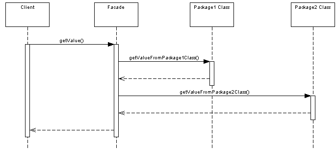

# Design Patterns
---

## Creational

### Singleton

### Factory

Creates objects without exposing the instantiation logic to the client and Refers to the newly created object through a common interface. When a method returns one of several possible classes that share a common super class.

The factory pattern allows you to create objects without specifying the exact class of object that will be created.

**Examples**

- java.sql.DriverManager#getConnection()
- java.net.URL#openConnection()
- java.lang.Class#newInstance()
- java.lang.Class#forName()

---

### Factory Method

---
### Abstract Factory

---
### Builder

---
### Prototype

---
### Object Pool

---

## Structural 
---

### Adapter
---

- Convert the interface of a class into another interface clients expect.

- Adapter lets classes work together, that could not otherwise because of incompatible interfaces.

The classes/objects participating in adapter pattern:
- **Target** - defines the domain-specific interface that Client uses.
- **Adapter** - adapts the interface Adaptee to the Target interface.
- **Adaptee** - defines an existing interface that needs adapting.
- **Client** - collaborates with objects conforming to the Target interface.

The Adapter pattern lets you to adapt what an object or a class exposes to what another object or class expects. It converts the interface of a class into another interface the client expects. It lets classes work together that couldn’t otherwise because of incompatible interfaces. It allows to fix the interface between the objects and the classes without modifying the objects and the classes directly.

One can think of an Adapter as a real world adapter which is used to connect two different pieces of equipment that cannot be connected directly. An adapter sits in-between these equipments, it gets the flow from the equipment and provides it to the other equipment in the form it wants, which otherwise, is impossible to get due to their incompatible interfaces.

An adapter uses composition to store the object it is supposed to adapt, and when the adapter’s methods are called, it translates those calls into something the adapted object can understand and passes the calls on to the adapted object. The code that calls the adapter never needs to know that it’s not dealing with the kind of object it thinks it is, but an adapted object instead.

## Examples in Java

- java.util.Arrays#asList()
- java.io.InputStreamReader(InputStream) (returns a Reader)
- java.io.OutputStreamWriter(OutputStream) (returns a Writer)

---

---

## Facade

The Facade design pattern simplifies the interface to a complex system; because it is usually composed of all the classes which make up the subsystems of the complex system.

A Facade shields the user from the complex details of the system and provides them with a simplified view of it which is easy to use. It also decouples the code that uses the system from the details of the subsystems, making it easier to modify the system later.

the Facade can be used to hide the inner workings of a third party library, or some legacy code. All that the client needs to do is interact with the Facade, and not the subsystem that it is encompassing.

Facade discusses encapsulating a complex subsystem within a single interface object. This reduces the learning curve necessary to successfully leverage the subsystem. It also promotes decoupling the subsystem from its potentially many clients. On the other hand, if the Facade is the only access point for the subsystem, it will limit the features and flexibility that "power users" may need.

**Uses**:

Service oriented architectures make use of the facade pattern. For example, in web services, one web service might provide access to a number of smaller services that have been hidden from the caller by the facade.

---
### Bridge

### Composite

### Decorator

### Flyweight

**Intent**

- Use sharing to support large numbers of fine-grained objects efficiently.

### Memento

### Proxy

---

## Behavioral
---

### Chain of Responsibilty

Gives more than one object an opportunity to handle a request by linking receiving objects together.

**Reference implementations in JDK**

javax.servlet.Filter#doFilter()

The doFilter method of the Filter is called by the container each time a request/response pair is passed through the chain due to a client request for a resource at the end of the chain. The FilterChain passed in to this method allows the Filter to pass on the request and response to the next entity in the chain.

java.util.logging.Logger#log

If the logger is currently enabled for the given message level then the given message is forwarded to all the registered output Handler objects.

---
### Command

### Interpreter

### Iterator

### Mediator

### Observer

### Strategy

### Template method

### Visitor

### Null Object

---
