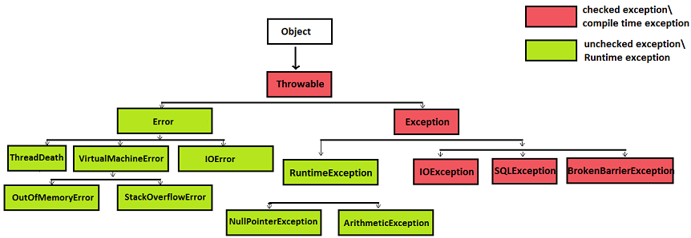

# Exceptions



**Checked exceptions**

Checked exceptions also know as compile time exceptions are those which need to be taken care at compile time.

- The class Exception and all its subclasses that are not also subclasses of RuntimeException are checked exceptions.
- For propagating checked exceptions method must throw exception by using `throws` keyword
- If superclass method throws/declare checked exception
	- overridden method of subclass can declare/throw narrower (subclass of) checked exception.
	- overridden method of subclass cannot declare/throw broader (superclass of) checked exception.
	- overridden method of subclass can declare/throw any unchecked /RuntimeException.

**Unchecked exceptions**

Unchecked exceptions also known as runtime exceptions are those which need to be taken care at runtime. 

- The class RuntimeException and all its subclasses are unchecked exceptions. By extending `java.lang.RuntimeException`, we can create unchecked exception.
- unchecked exceptions are automatically propagated in java.
- If superclass method throws/declare unchecked exception
	- overridden method of subclass can declare/throw any unchecked /RuntimeException (superclass or subclass).
	- overridden method of subclass cannot declare/throw any checked exception.

---
	
## java.lang.Error

- Error is a subclass of Throwable 
- Error indicates some serious problems that our application should not try to catch because, in most of cases recovery from an Error is almost impossible. So, application must be allowed to terminate.  
- Errors are abnormal conditions in application.

---

### finally block

- finally block is always executed irrespective of exception is thrown or not.
- finally block is optional in java, we may use it or not.
- finally block is not executed in following scenarios 
	- finally is not executed when System.exit is called.
	- if in case JVM crashes because of some java.util.Error. 
- use finally block to perform clean up activities like database connection closing etc.
	
**System.exit(n) method**

- System.exit terminates JVM. 
- Parameter
	- Passing zero as parameter means normal termination &
	- Passing non-zero as parameter means abnormal termination.
- `System.exit(n)` internally calls `Runtime.getRuntime().exit(n)`	

- When catch and finally block both return value, method will ultimately return value returned by finally block irrespective of value returned by catch block.
- When try and finally block both return value, method will ultimately return value returned by finally block irrespective of value returned by try block.

---

### stack trace in exceptions

A stack trace is the list of the methods from which the method is called which throws some Exception in java.

### Exception chaining
 
When Exception is thrown we catch it and throws some other Exception than the concept is called Exception chaining in java.

---

### static blocks

- static blocks are called as soon as class is loaded even before instance of class is created (i.e. before constructor is called).

- static blocks executes before instance blocks.
- Any code written inside static block is thread safe.

- Java does not allows static initialization block to throw any exception, though it is allowed to use use try-catch block inside static initialization block.

- If any RuntimeException occurs in static initialization block of class then java.lang.ExceptionInInitializerError is thrown. So, we can catch ExceptionInInitializerError and handle exception thrown from static block in java.


---

## ArrayStoreException

Thrown to indicate that an attempt has been made to store the wrong type of object into an array of objects. For example, the following code generates an ArrayStoreException:
```java
     Object x[] = new String[3];
     x[0] = new Integer(0);
```