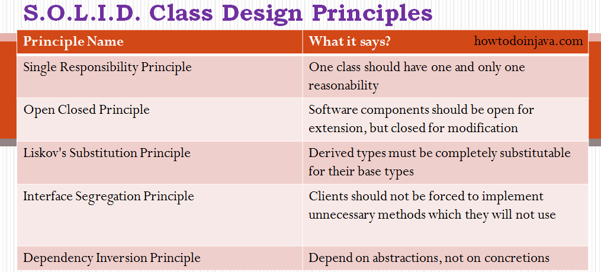

# OOPS and OOAD

# S.O.L.I.D. principles in java

 

---

## Object-Oriented Analysis

Object-oriented analysis is a method of analysis that examines requirements from the perspective of the classes and objects found in the vocabulary of the problem domain.

The primary tasks in object-oriented analysis (OOA) are:

- Identifying objects

- Organizing the objects by creating object model diagram

- Defining the internals of the objects, or object attributes

- Defining the behavior of the objects, i.e., object actions

- Describing how the objects interact

---

## Overloading and Overriding

Different implementation of a class has different way of doing certain thing than overriding is the way to go while overloading is doing same thing but with different input. Method signature varies in case of overloading but not in case of overriding in java.
