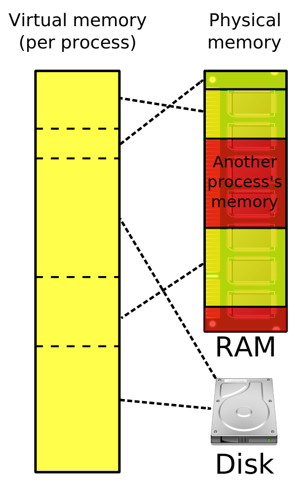

# Deadlock

In concurrent computing, a **deadlock** is a state in which each member of a group of actions, is waiting for some other member to release a lock.

A **livelock** is similar to a deadlock, except that the states of the processes involved in the livelock constantly change with regard to one another, none progressing. Livelock is a special case of resource starvation; the general definition only states that a specific process is not progressing.

A real-world example of livelock occurs when two people meet in a narrow corridor, and each tries to be polite by moving aside to let the other pass, but they end up swaying from side to side without making any progress because they both repeatedly move the same way at the same time.

Livelock is a risk with some algorithms that detect and recover from deadlock. If more than one process takes action, the deadlock detection algorithm can be repeatedly triggered. This can be avoided by ensuring that only one process (chosen randomly or by priority) takes action.

---

## Memory

- Virtual memory technique virtualizes the main storage available to a process or task, as a contiguous address space which is unique to each running process, or virtualizes the main storage available to all processes or tasks on the system as a contiguous global address space.

---

## Mutexes, Semaphores, Locks

- *Lock* is a generic term for an object that works like a key and allows the access to a target object only by one thread. Only the thread which owns the key can unlock the "door".
- *Monitor* is a cross-thread lock. In Java every object is a monitor.
- Lock allows only one thread to enter the part that's locked and the lock is not shared with any other processes.
- Mutex and Semaphore are kernel resources that provide synchronization services.

**Mutex**

- Mutex is a cross-process lock, same as a lock but system wide.
- Mutex is a locking mechanism used to synchronize access to a resource.
- Mutex provides mutual exclusion, either producer or consumer can have the key (mutex) and proceed with their work.
- Java has no system-wide mutex support.

**Semaphore**

- Semaphore is signaling mechanism ("I am done, you can carry on" kind of signal).
- A particular lock that allows more than one thread to access the target object. It's like having more keys, so that many people can unlock the door.
- Semaphore is a generalized mutex; if upper bound is set to one (1) it's the same as a monitor.
- Does the same as a lock but allows x number of threads to enter.

---

## Processes

- Processes are often seen as synonymous with programs or applications. However, what the user sees as a single application may in fact be a set of cooperating processes. To facilitate communication between processes, most operating systems support Inter Process Communication (IPC) resources, such as pipes and sockets. IPC is used not just for communication between processes on the same system, but processes on different systems.

## Starvation 

Starvation describes a situation where a thread is unable to gain regular access to shared resources and is unable to make progress. This happens when shared resources are made unavailable for long periods by "greedy" threads. For example, suppose an object provides a synchronized method that often takes a long time to return. If one thread invokes this method frequently, other threads that also need frequent synchronized access to the same object will often be blocked.

---

## Race Conditions

- A race condition occurs when 2 or more threads are able to access shared data and they try to change it at the same time. Because the thread scheduling algorithm can swap between threads at any point, you don't know the order at which the threads will attempt to access the shared data. Therefore, the result of the change in data is dependent on the thread scheduling algorithm, i.e. both threads are 'racing' to access/change the data.

- Often problems occur when one thread does a "check-then-act" (e.g. "check" if the value is X, and then "act" to do something that depends on the value being X) and another thread does something to the value in between the "check" and the "act".

- In order to prevent race conditions occurring, typically you would put a lock around the shared data to ensure that only one thread can access the data at a time.

